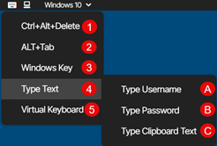
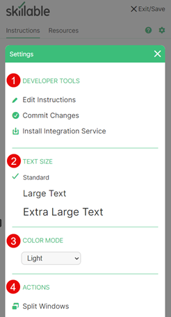

# Lab Interface 

The lab interface is displayed in two different configurations, depending on the lab components in your lab. 

- Virtualization based labs are displayed in a single browser window.
- Cloud based labs are displayed in two browser windows.

Within the lab interface, some buttons expand to display a menu of options. 

>[!alert] Some buttons or menus may not be available to you, depending on your account configuration. 

  - [Overview](#overview)
    - [Commands Menu](#commands-menu)
    - [Display Menu](#display-menu)
    - [Exit/Save Menu](#exitsave-menu)
    - [Settings Menu](#settings-menu)
  - [Lab Interface FAQ](#lab-interface-faq)

## Overview

1. **Commands menu**: Contains advanced keyboard functions. See the [Commands menu](#commands-menu) section for more information. 

1. **Display menu**: Contains display settings. See the [Display menu](#display-menu) section for more information.

1. **Virtual machine selector**: Allow the lab user to select the virtual machine required

1. **Connection indicator**: Displays the connection quality between your local machine and the virtual machine in the lab environment. This is only displayed if the connection quality is poor. For more information about each connection quality description, or to conduct a speed test, please see our [Skillable Speed Test](https://www.skillable.com/speedtest/).

1. **Lab header**: Contians either a company logo or the lab title.

1. **Exit/Save menu**: Contains options to save the lab and return to it later or end you lab. See the [Exit/Save menu](#exitsave-menu) section for more information. 

    **NOTE**: some of these options may not be available to you, depending on your account configuration. 

1. **Lab instruction pane**: Displays the lab instructions. 

1. **Lab resources**: Contains lab resources such as virtual machines, cloud resources, and any credentials needed to complete the lab instructions. This is also where you can load files into your virtual machine. 
    >[!knowledge] To load files into your VM, select the VM you wish to load files to and then select _Load Files_ and follow the instructions in the dialog window.

1. **Notifications**: If notifications have been set to the lab either via an LCA or the Instructor as well as popping up the notifications can be accessed behind the icon.

1. **Lab help**: Contains lab theme settings, lab instance ID, FAQ and a link to submit a support request. 

    **NOTE**: The Help tab may not be available to you, depending on your learning organization settings. 

1. **Settings menu**: Controls access to lab developer and lab user specfic controls. 

1. **Instruction resizer**: Drag left and right to adjust the size of the instruction pane.

1. **Previous lab instruction**: Navigates to the previous page in the lab instructions. 

1. **Next lab instruction**: Navigates to the next page in the lab instructions, or to exit the lab eith either an End or Submit depending if the lab is scored. 

1. **Lab timer**: Displays the time remaining in the current lab.

1. **Virtual machine or cloud platform (depending on lab configuration)**: The virtual machine in focus, or the cloud platform (if the lab doesn't use virtual machines).

### Commands Menu 

>[!alert] The Commands menu is not available in labs that do not use virtual machines. 

1. **Ctrl+Alt+Delete**: Sends the Ctrl-Alt-Delete key combination to the virtual machine. 
1. **ALT+Tab**: Sends the ALT+Tab key combination to the virtual machine. 
1. **Windows Key**: Sends the Windows key command to the virtual machine. 
1. **Type Text**:  

    A. **Type Username**: Types the username into the virtual machine at the current cursor position.

    B. **Type Password**: Types the password into the virtual machine at the current cursor position.

    C. **Type Clipboard Text**: Opens a dialog box to paste text into from your local clipboard, and paste into the virtual machine at the current cursor position. 
    
1. **Virtual Keyboard**: This enables an on-screen virtual keyboard that can be used to input keystrokes into the virtual machine. 

### Display Menu 

The Display menu is split into two sections:

1. Display Options
1. Machine Options

#### Display Options

1. **Full Screen**: Sets the lab to display in a full screen window. 

1. **Fit Machine to Window**: This resizes the virtual machine to fit the browser window. 

1. **Reconnect**: This will reconnect your local machine to the remote virtual machine, if the connection is interrupted.

#### Machine Options

1. **Reconnect**: This retries the connection between the local machine and the virtual machine. 

1. **Pause**: This puts the virtual machine into a paused state. Once it is paused, it must be resumed to continue using the virtual machine. 
    
1. **Reset/Reboot**: This reboots the virtual machine. This **does not** gracefully shut down the machine. It is recommended to save your work before using this. 
    
1. **Power Off**: This powers down the virtual machine.

1. **Snaphots**: If enabled allows the lab user to create, apply and delete snaphots.

1. **Reset Internet Gateway**: Resets the gateway that the virtual machine uses to connect to the internet. 

### Exit/Save Menu 

{700}

1. **Save Progress and Exit**: This allows you to save your lab and return to it later. Please note the expiration date and time that is displayed after you save your lab. Once the expiration date and time has elapsed, the lab is cancelled and any work in the lab will be lost.

1. **End Lab**: Will end the lab.  New launches will start the lab from the beginning.

### Settings Menu 

The Settings menu is split into upto four sections.  The sections displayed depend on permisions of the lab user.  The four sections are:

1. Developer Tools
1. Text Size    
1. Color Mode
1. Actions

#### Developer Tools

1. **Edit Instructions**: This allows lab authors to edit the instructions that are displayed in the instruction pane of the lab.
2. **Commit Changes**: Allows the saving of changes made to the virtual machines to make those changes permanent.

    i. **Commit my changes and update this lab profile**: This allows lab authors to commit changes to virtual machines in the lab, so that subsequent lab launches will contain those changes. 

    ii. **Commit my changes and create a new lab profile**: This allows lab authors to commit changes to virtual machines in the lab and save a new lab profile with the changes. 
3. **Install Integration Service**: This installs the Skillable Studio Integration Service. This allows automatic screen resizing (limited resolutions)
 and executing UI commands within a virtual machine.

#### Text Size

Allows the selection of the text size within the Lab Client to change the size of the Instruction and Resources pages.

#### Color Mode

Allows a lab user to switch between one of three color modes.  The modes are light, dark and high contrast.  The availability of color modes and the color schemes for each mode are controlled by Themes

#### Actions
    
1. **Split Windows**: This allows splitting the windows into two separate windows; with the Virtual machine in one window, and the lab instruction pane in another window. After windows are split, this button will change to display _Join Windows_, this is used to join the windows back together into a single browser window. 

## Lab Interface FAQ

To read frequently asked questions about the lab interface, read [Lab Interface FAQ](/lod/lab-interface-faq.md).

<!--search terms-->

<b>lab extension</b>
<b>lab save</b>
<b>lab timer</b>
<b>timer</b>

